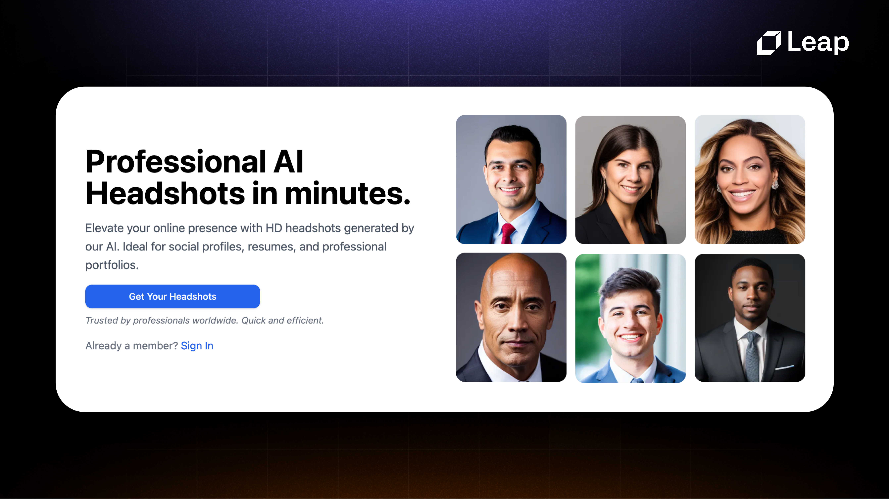
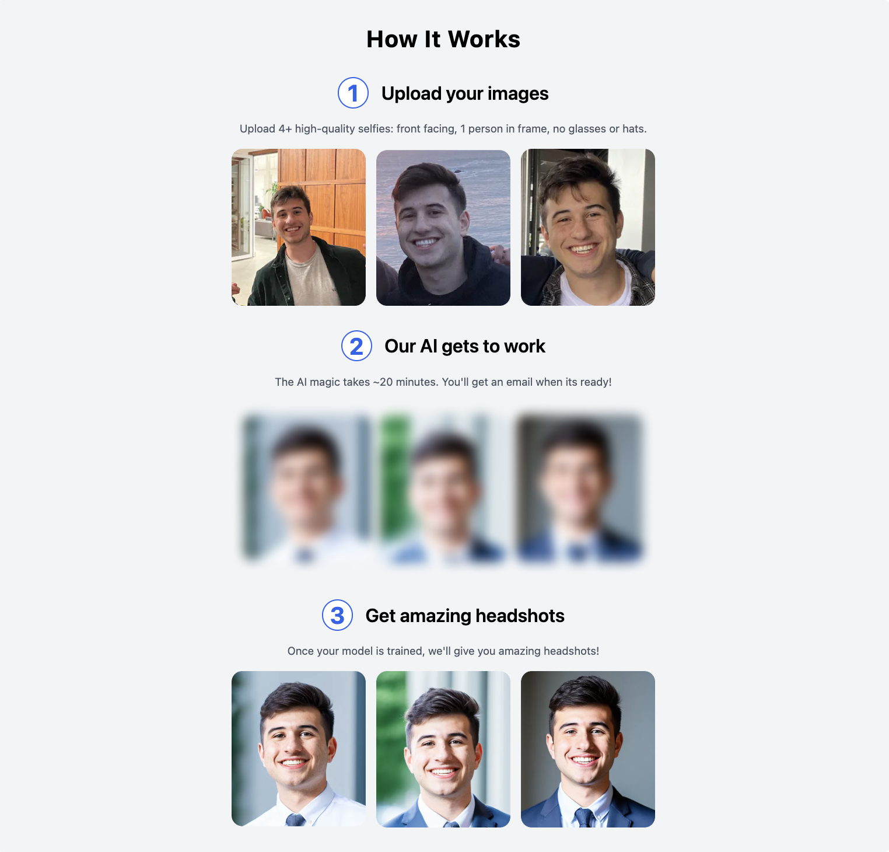
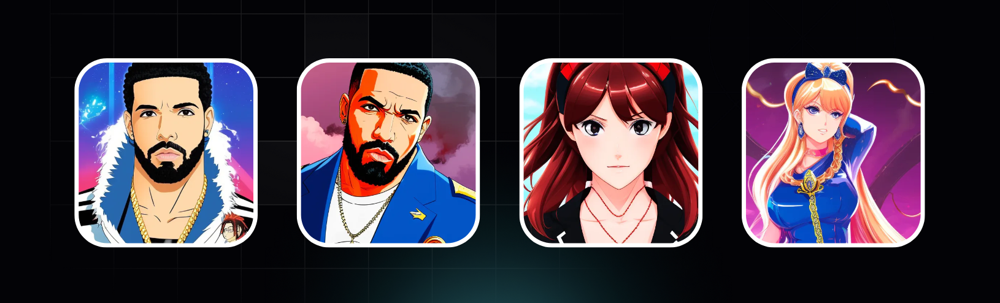
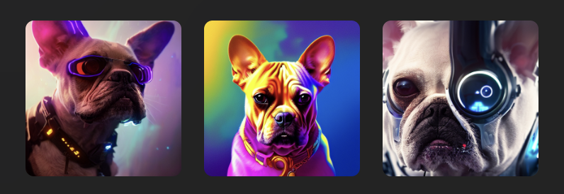

# 👨‍💼 Headshot AI - Professional Headshots with AI

Introducing Headshot AI, an open-source project from [Leap AI](https://tryleap.ai/) that generates Professional AI Headshots in minutes.

[](https://vercel.com/import/project?template=https://github.com/leap-api/headshots-starter.git)

[](https://tryleap.ai/)

## How It Works

The app is powered by:

- ▲ [Next.js](https://nextjs.org/) for app and landing page
- 🔋 [Supabase](https://supabase.com/) for DB & Auth
- 🚀 [Leap AI](https://tryleap.ai/) for Dreambooth model training
- 🚀 [Leap AI](https://tryleap.ai/) to generate headshots
- 📩 [Resend](https://resend.com/) to email user when headshots are ready
- ⭐️ [Shadcn](https://ui.shadcn.com/) with [Tailwind CSS](https://tailwindcss.com/) for styles

Just add Stripe and you have a Headshot AI SaaS in a box.

[](https://tryleap.ai/)

## Running Locally

To create your own Headshot AI app, follow these steps:

1. Clone the repository:

```
git clone https://github.com/leap-ai/headshots-starter.git
```

2. Enter the `headshots-starter` directory:

```
cd headshots-starter
```

3. Install dependencies:

   For npm:

   ```bash
   npm install
   ```

   For yarn:

   ```bash
   yarn
   ```

4. Create a [new Supabase project](https://database.new)

   - Rename `.env.local.example` to `.env.local` and update the values for `NEXT_PUBLIC_SUPABASE_URL` and `NEXT_PUBLIC_SUPABASE_ANON_KEY` from [your Supabase project's API settings](https://app.supabase.com/project/_/settings/api)

5. Create a [Leap AI](https://tryleap.ai/) account

   In your `.env.local` file:

   - Fill in `your_api_key` with your [Leap API key](https://docs.tryleap.ai/authentication)
   - Fill in `your-hosted-url/leap/train-webhook` with https://{your-hosted-url}/leap/train-webhook
   - Fill in `your-hosted-url/leap/image-webhook` with https://{your-hosted-url}/leap/image-webhook
   - Fill in `your-webhook-secret` with

6. Create a [Resend](https://resend.com/) account

   - Fill in `your-resend-api-key` with your Resend API Key

7. Start the development server:

   For npm:

   ```bash
   npm run dev
   ```

   For yarn:

   ```bash
   yarn dev
   ```

8. Visit `http://localhost:3000` in your browser to see the running app.

## One-Click Deploy

Deploy the example using Vercel:

[](https://vercel.com/import/project?template=https://github.com/leap-api/headshots-starter.git)

## Additional Use-Cases

Headshot AI can be easily adapted to support many other use-cases on [Leap AI](https://tryleap.ai/) including:

- AI Avatars
  - [Anime](https://blog.tryleap.ai/transforming-images-into-anime-with-leap-ai/)
  - [Portraits](https://blog.tryleap.ai/ai-time-machine-images-a-glimpse-into-the-future-with-leap-ai/)
  - [Story Illustrations](https://blog.tryleap.ai/novel-ai-image-generator-using-leap-ai-a-comprehensive-guide/)

[](https://tryleap.ai/)

- Pet Portraits

[](https://tryleap.ai/)

- Product Shots
- Food Photography

[](https://tryleap.ai/)

- Icons
- [Style-Consistent Assets](https://blog.tryleap.ai/how-to-generate-style-consistent-assets-finetuning-on-leap/)

[](https://tryleap.ai/)

& more!

## Contributing

We welcome collaboration and appreciate your contribution to Headshot AI. If you have suggestions for improvement or significant changes in mind, feel free to open an issue!

## Resources and Support

- Discord Community: [Leap Discord](https://discord.gg/NCAKTUayPK)
- Help Email: help@tryleap.ai

## License

Headshot AI is released under the [MIT License](https://choosealicense.com/licenses/mit/).
